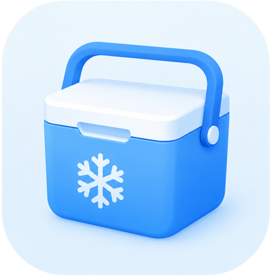

# LabFreezer

<p align="center">
  
</p>

<h3 align="center">A local-first freezer box management app for laboratory samples</h3>

<p align="center">
  Manage, search and record laboratory freezer samples easily and privately.
</p>

---

## Introduction

**LabFreezer** is an Android application designed for researchers to manage samples stored in laboratory freezer boxes.

It provides a simple way to:

- Record sample locations
- Organize freezer box layouts
- Search samples quickly
- Attach photos and notes
- Automatically fill information using OCR
- Export and import data locally

LabFreezer follows a **local-first design philosophy**:

- All data is stored locally
- No cloud dependency
- No mandatory account system
- Suitable for laboratories with privacy requirements

---

## Features

### 🧊 Freezer Box Management

- Manage multiple freezers and boxes
- Organize samples with hierarchical structures
- Quickly locate stored samples

### 🔍 Smart Search

Search by:

- Sample name
- Alias
- Notes
- Date information
- Storage location

### 📷 Photo Recording

Record sample information with local photos:

- Freezer box images
- Sample label images
- Experimental notes

### 🔤 OCR Auto Fill

Built-in OCR helps extract information from sample labels.

OCR processing runs locally on the device. Images are not uploaded to external services.

### 📦 Data Export & Import

Support local data migration:

- Export sample information
- Export related images
- Import data on another device
- Merge data while avoiding ID conflicts

### 🎨 Modern Android UI

Built with modern Android technologies:

- Jetpack Compose
- Material Design 3
- Edge-to-edge UI
- Adaptive layouts

---

## Tech Stack

| Component | Technology |
|---|---|
| Language | Kotlin |
| UI | Jetpack Compose |
| Architecture | MVVM + Hilt |
| Database | Room |
| Image Loading | Coil |
| OCR | PaddleOCR |
| Build System | Gradle |

---

## Privacy

LabFreezer is designed for laboratory data privacy.

- No experimental data is uploaded
- No cloud storage is required
- No user tracking
- All records remain on the local device

---

## Installation

Clone the repository:

```bash
git clone https://github.com/Jiac-Xu/LabFreezer.git
```

Open the project with Android Studio and build:

```bash
./gradlew assembleDebug
```

Requirements:

- Android Studio
- JDK 17+
- Android SDK

---

## Roadmap

Completed:

- [x] Freezer box management
- [x] Sample information recording
- [x] Local database storage
- [x] Image attachment
- [x] OCR auto fill
- [x] Search system
- [x] Data export/import

Future:

- [ ] More flexible box templates
- [ ] Improved OCR recognition
- [ ] More export formats

---

## Contributing

Issues and suggestions are welcome.

If you find a bug or have a feature request, please open an Issue.

---

## Author

Created by **Jiac-Xu**
